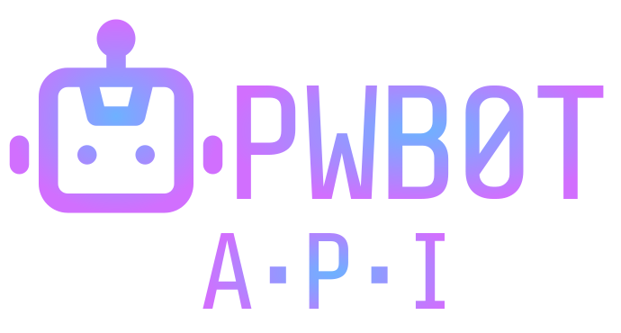

## POST a request, 🪄 get a shiny new password 🪄!

A REST API written in [Node.js](https://nodejs.org/en) wth [TypeScript](https://www.typescriptlang.org/) deployed to [Vercel Serverless Functions](https://vercel.com/docs/concepts/functions/serverless-functions)


### 🌐 Password Generation Endpoint

Request:

Send a `POST` request to the `https://pwbot-api.jgnovak.com/api/passwords` endpoint with a JSON body with the following options.

Example:

```json
{
    "length": 12,
    "useNumbers": true,
    "useUppercase": true,
    "useLowercase": true,
    "useSpecial": true,
}
```

Example Response:

```json
{
    "password": "8p,d;/n9HDS^"
}
```

### Options

**length**: A number between 6 and 64. Password length is clamped to at least 6 and no more than 64 characters.

**includeNumbers**: Include the numbers `0123456789` as possible characters in the password.

**includeUppercase**: Include uppercase letters of the [ASCII alphabet](https://en.wikipedia.org/wiki/ASCII) as possible characters in the password.

**includeLowercase**: Include lowercase letters of the [ASCII alphabet](https://en.wikipedia.org/wiki/ASCII) as possible characters in the password.

**includeSpecialCharacters**: Include special characters `!@#$%^&*-_=+<>?;:[]{}(),./|` as the possible characters for the password.

